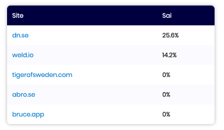
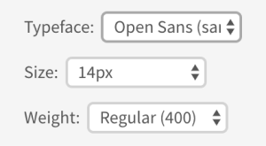

# React Zero-Config Components

React components that require _zero_ configuration.

Note: no styling, CSS must be applied elsewhere in your code.

## Installation

    yarn add react-zeroconfig-components  # or: npm install react-zeroconfig-components

## Components

See the Storybook stories in `/stories` to see how the components are used in code.

### Table

    <Table
      array={arrayOfObjects}
      customFormat={optionalCustomFormat}
    />

    const optionalCustomFormat = (field, value) => {
      /* return formatted value */
    }

### SelectDropdown

    <SelectDropdown
      options={arrayOfStringsOrObjects}
      value={currentValue}
      onChange={event => handleChange(event)}
    />

### TabMenu

    <TabMenu
      options={arrayOfStringsOrObjects}
      value={currentValue}
      onChange={event => handleChange(event)}
    />

## Developing components

### Create new component

    yarn new

### How to test and preview

Preview components in Storybook:

    yarn storybook

...then open http://localhost:6006/ in your browser.

### How to build and deploy

    yarn prepare
    yarn publish
