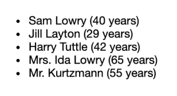
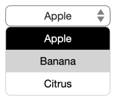

# React Zero-Config Components

React components that require _zero_ configuration.

## Installation

    yarn add react-zeroconfig-components  # or: npm install react-zeroconfig-components

## Accessibility

- [x] All components use `button` where applicable
- [x] Keyboard/tab support

## Styling

Styling is optional, CSS files are included but you can also use `styled-components` or similar.

How to import CSS file, example:

    import '../node_modules/react-zeroconfig-components/dist/TokenList.css'

## Components

See the Storybook stories in `/stories` to see how the components are used in code, including more advanced use cases.

### List

    <List
      values={arrayOfObjects}
      ordered={false}
      customFormat={optionalCustomFormat}
    />

    const optionalCustomFormat = (row) => {
      /* return formatted value */
    }

### RadioButtons

    <RadioButtons
      options={arrayOfStringsOrObjects}
      value={currentValue}
      onChange={event => handleChange(event)}
    />

### Table

    <Table
      values={arrayOfObjects}
      customFormat={optionalCustomFormat}
    />

    const optionalCustomFormat = (field, value) => {
      /* return formatted value */
    }

### SelectDropdown

    <SelectDropdown
      options={arrayOfStringsOrObjects}
      value={currentValue}
      onChange={event => handleChange(event)}
    />

### SelectMenu

    <SelectMenu
      options={arrayOfStringsOrObjects}
      value={currentValue}
      onChange={event => handleChange(event)}
    />

### TabMenu

    <TabMenu
      options={arrayOfStringsOrObjects}
      value={currentValue}
      onChange={event => handleChange(event)}
    />

Advanced example:

    <TabMenu
      options={arrayOfStringsOrObjects}
      value={currentValue}
      onChange={handleChange}
      
      elementType='nav'
      customChild={MyCustomComponent}
    />

### TokenList

    <TokenList
      options={arrayOfStringsOrObjects}
      value={currentValue}
      onRemove={token => onRemove(token)}
    />

### TokenInput

    <TokenInput
      options={arrayOfStringsOrObjects}
      value={smallerArrayOfStringsOrObjects}
      onAdd={handleAdd}
      onRemove={handleRemove}
    />

### TokenSearchInput

    <TokenSearchInput
      value={arrayOfStringsOrObjects}
      onSearch={async (searchText) => { return foundMatch }}
      onAdd={handleAdd}
      onRemove={handleRemove}

      placeholder='Type here to search'
      canAddAny={true}
    />

### SearchInput

    <SearchInput
      onSearch={async (searchText) => { return foundMatch }}
      onSubmit={handleSubmit}

      placeholder='Type here to search'
      canSubmitAny={true}
    />

### Card

    <Card
      layer={0}
      visible={isVisible}
      onClose={event => setIsVisible(!isVisible)}
    >
      (...content...)
    </Card>
    <Card
      layer={1}
      ...
    />

## Events

- `onAdd`
- `onChange`
- `onClose`
- `onRemove`
- `onSearch`
- `onSelect`
- `onSubmit`

## Developing components

### Create new component

    yarn new

### How to test and preview

Preview components in Storybook:

    yarn storybook

...then open http://localhost:6006/ in your browser.

### How to build and deploy

    yarn publish  # yarn prepare (Babel) will be run automatically
