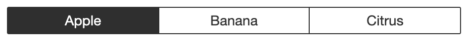
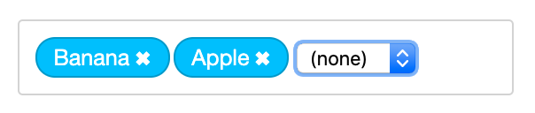

# React Zero-Config Components

React components that require _zero_ configuration.

## Installation

    yarn add react-zeroconfig-components  # or: npm install react-zeroconfig-components

## Accessibility

- [x] All components use `button` where applicable
- [x] Keyboard/tab support

## Styling

Styling is optional, CSS files are included but you can also use `styled-components` or similar.

How to import CSS file, example:

    import '../node_modules/react-zeroconfig-components/dist/TokenList.css'

## Components

See the Storybook stories in `/stories` to see how the components are used in code, including more advanced use cases.

### List

    import { List } from 'react-zeroconfig-components'

    <List
      values={arrayOfObjects}
      numbered={false}
      customFormat={optionalCustomFormat}
    />

    const optionalCustomFormat = (row, index) => {
      /* return formatted value */
    }

### EditInPlace

    <EditInPlace
      placeholder='Edit headline'
      value={article.headline}
      onChange={headline => updateArticle({ headline })}
      canEdit={!!user}
      style={{ fontSize: '2.5em' }}
    >
      <h1>{article.headline}</h1>
    </EditInPlace>

### RadioButtons

    <RadioButtons
      options={arrayOfStringsOrObjects}
      value={currentValue}
      onChange={value => handleChange(value)}
    />

### ToggleSwitch

    <ToggleSwitch
      value={currentValue}
      onChange={value => handleChange(value)}
    />

### Table

    <Table
      values={arrayOfObjects}
      customFormat={optionalCustomFormat}
    />

    const optionalCustomFormat = (field, value, rowIndex, columnIndex) => {
      /* return formatted value */
    }

### ListCard

    <ListCard
      name='Sam Lowry'
      details='Main character'
      imageUrl='https://pbs.twimg.com/profile_images/943955598718017536/XVuOSUzc_400x400.jpg'
    >
      <button>Edit</button>
      <button>Delete</button>
    </ListCard>

### SelectDropdown

    <SelectDropdown
      options={arrayOfStringsOrObjects}
      value={currentValue}
      onChange={value => handleChange(value)}
    />

### SelectMenu

    <SelectMenu
      options={arrayOfStringsOrObjects}
      value={currentValue}
      onChange={value => handleChange(value)}
    />

### TabMenu

    <TabMenu
      options={arrayOfStringsOrObjects}
      value={currentValue}
      onChange={value => handleChange(value)}
    />

Advanced example:

    <TabMenu
      options={arrayOfStringsOrObjects}
      value={currentValue}
      onChange={handleChange}
      
      elementType='nav'
      customChild={MyCustomComponent}
    />

### TokenList

    <TokenList
      options={arrayOfStringsOrObjects}
      value={currentValue}
      onSelect={token => handleSelect(token)}
      onRemove={token => handleRemove(token)}
    />

### TokenInput

    <TokenInput
      options={arrayOfStringsOrObjects}
      value={smallerArrayOfStringsOrObjects}
      onAdd={handleAdd}
      onRemove={handleRemove}
    />

### TokenSearchInput

    <TokenSearchInput
      value={arrayOfStringsOrObjects}
      onSearch={async (searchText) => { return foundMatch }}
      onAdd={handleAdd}
      onRemove={handleRemove}

      placeholder='Type here to search'
      canAddAny={true}
    />

### SearchInput

    <SearchInput
      onSearch={async (searchText) => { return foundMatch }}
      onSubmit={handleSubmit}

      placeholder='Type here to search'
      canSubmitAny={true}
    />

### Card

    <Card
      layer={0}
      visible={isVisible}
      onClose={event => setIsVisible(!isVisible)}
    >
      (...content...)
    </Card>
    <Card
      layer={1}
      ...
    />

## Events

- `onAdd`
- `onChange`
- `onClose`
- `onRemove`
- `onSearch`
- `onSelect`
- `onSubmit`

## Developing components

### Create new component

    yarn new

### How to test and preview

Preview components in Storybook:

    yarn storybook

...then open http://localhost:6006/ in your browser.

### How to build and publish a new NPM package

    yarn publish  # yarn prepare (Babel) will be run automatically

## Troubleshooting

React Hook order error:

> Invalid hook call. Hooks can only be called inside of the body of a function component. This could happen for one of the following reasons:
> 1. You might have mismatching versions of React and the renderer (such as React DOM)
> 2. You might be breaking the Rules of Hooks
> 3. You might have more than one copy of React in the same app
> See https://fb.me/react-invalid-hook-call for tips about how to debug and fix this problem.

Solution: check if conflicting versions:

    yarn list react  # or npm ls react

## Todo

- [ ] Range slider
- [ ] Range slider 2D
